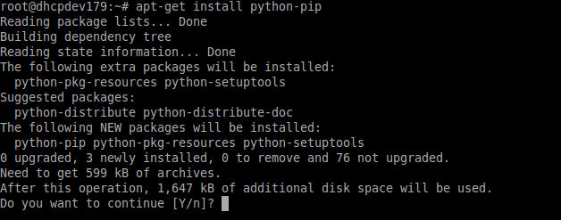
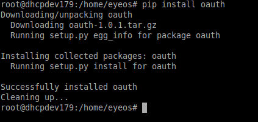
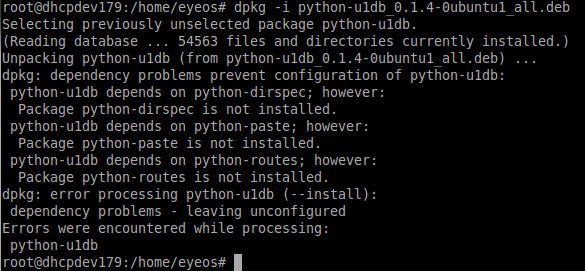
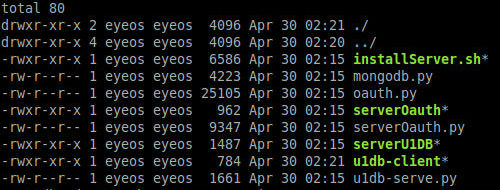
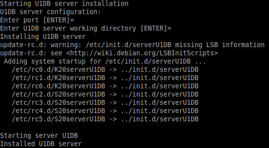
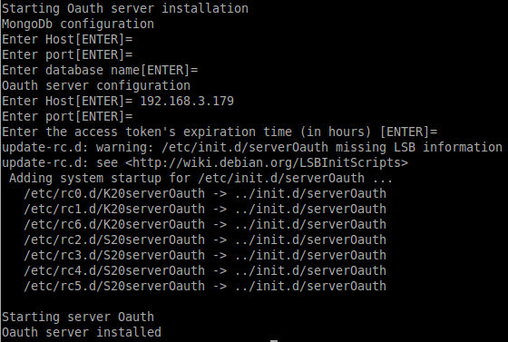
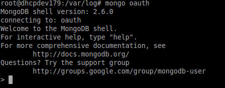

#Installation U1DB server & Oauth server
---

**Table contents**

* [Installation](#Instalacion)
    * [Requirements](#Requisitos)
    * [Step by step](#Pasos)

##Installation

The installation will be done on a Ubuntu 12.04 operating system, you can choose a higher version, but then the requirements might be different.

###Requirements
                 
                    
+    **MongoDb**

    \# sudo apt-key adv --keyserver hkp://keyserver.ubuntu.com:80 --recv 7F0CEB10
    
    

    \# echo 'deb http://downloads-distro.mongodb.org/repo/ubuntu-upstart dist 10gen' | sudo tee /etc/apt/sources.list.d/mongodb.list
    
    

    \# apt-get update
    
            

    \# apt-get install mongodb-org=2.6.0 mongodb-org-server=2.6.0 mongodb-org-shell=2.6.0 mongodb-org-mongos=2.6.0 mongodb-org-tools=2.6.0
    
                    

    \# echo "mongodb-org hold" | sudo dpkg –set-selections      
    \# echo "mongodb-org-server hold" | sudo dpkg --set-selections      
    \# echo "mongodb-org-shell hold" | sudo dpkg --set-selections      
    \# echo "mongodb-org-mongos hold" | sudo dpkg --set-selections      
    \# echo "mongodb-org-tools hold" | sudo dpkg –set-selections
    
    

    \# mongo –version
    
    

    \# service mongod status
    
            
  
 
+   **PyMongo**

    \# apt-get install build-essential python-dev  
    
    
            
    \# apt-get install python-pip  
    
    

    \# pip install pymongo  
    
    
    
    

+   **Module Oauth**

    \# pip install oauth  
    
    

+   **U1DB**

    Install the package python-u1db_0.1.4-0ubuntu1_all.deb. This package is present in the folder '/var/www/eyeos/eyeos/packages'.  
    
    \# dpkg -i python-u1db_0.1.4-0ubuntu1_all.deb  
    
    
    
    \# apt-get install python-u1db  
    
    
    
    \# apt-get -f install  
    
    

    \# dpkg -i python-u1db_0.1.4-0ubuntu1_all.deb  
    
    

###Step by step

Check the following files are present in the folder '/var/www/eyeos/serverU1DB':  
    

Then run, with administrator privileges, the script 'installServer.sh':  

\# ./installServer.sh  

During this script execution two services configuration will be requested. This services are:  

+   **U1DB server**. The listening port and the directory where the databases are stored will be asked. If no data is entered, by default, it is configured the port 9000 and the directory /var/lib/u1db/.  

    

+   **Oauth server**. It is needed to configure two things: Mongodb and the server itself.
For the Mongodb the IP, connection port and the database's name are requested. If no data are entered, by default is localhost, 27017 and oauth.  For the Oauth server IP, listening port and  the access token's expiration time are requested. If no data are entered, by default is localhost, 9000 and 24 hours.

    
    
    The Oauth server's ip and listening port should be remembered to configure the calendars' synchronization into eyeOS platform.  

Once the installation is completed, it should be verified that the services are running:  
    
\# service serverOauth status  
    

    
\# service serverU1DB status  
    

This services generate log files into '/var/log/' with corresponding names serverOauth.log and serverU1DB.log.  

Finally, make a connection to the database entered previously in the Oauth server's installation (mongodb section), to insert the consumer and request token of the eyeOS consumer.  

\# mongo oauth (or the db name entered)  

  

Enter the consumer following the structure used in the next example, in which you can only change the settings 'key' and 'secret':  

\# db.collection.insert({“type”:”consumer”,”key”:”eyeos”,”secret”:”secreteyeos”})  

These data are used to configure the calendars' synchronization into eyeOS platform.  

Enter the request token following the structure used in the next example, in which you can only change the settings 'key' and 'secret'. The consumerKey must be the same entered in the previous step:  

\# db.collection.insert({“type”:”requestToken”,”consumerKey”:”eyeos”,”key”:”requestEyeos”, ”secret”:”requestSecretEyeos”})  

Check the data entered using the sentence 'find':  

\# db.collection.find()  

It is possible to perform a selective search from a key, as eg:  

\# db.collection.find({“type”:”consumer”})  

If you want to remove an existing record you must use the sentence 'remove':  

\# db.collection.remove({“type”:”consumer”})  

